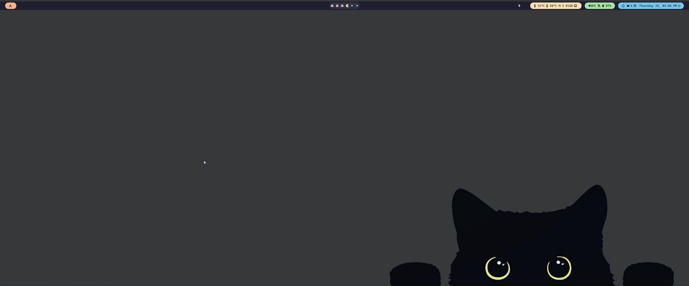

# Dotfiles

## arch/

- [Hyprland](https://github.com/hyprwm/Hyprland)
- [Kitty](https://sw.kovidgoyal.net/kitty/)
- [Swaylock](https://github.com/swaywm/swaylock)
- [Waybar](https://github.com/Alexays/Waybar)
- [Wlogout](https://github.com/ArtsyMacaw/wlogout)
- [Wofi](https://hg.sr.ht/~scoopta/wofi)
- [Swaync](https://github.com/ErikReider/SwayNotificationCenter)

## mac/

- zsh
- tmux
- [Neovim](https://neovim.io/) (LazyVim)
